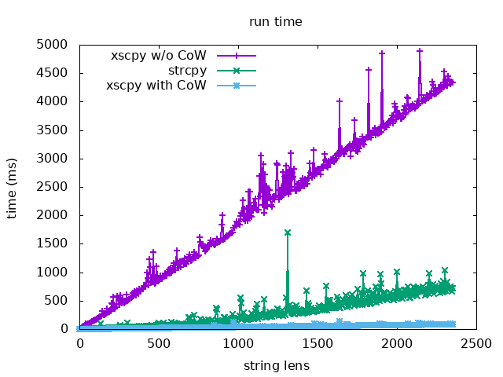

# [2020q1 quiz2](https://hackmd.io/@colinyoyo26/xs)
Use SSO (small string optimization) and CoW (copy on write) to optimize string, click the link for detail.

## Compile
`$ make test_cpy`

`$ make test_tok`

- Append `-DCOW` flag to use COW, e.g. `$ make test_tok -DCOW`

`$ make bench`
- Test performance of `xs_cpy` w/o CoW (running time and cache-misses)

`$ make bench COW=1`
- Test performance of `xs_cpy` with CoW

`$ make bench MODE=1`
- Test performance of `strcpy`

`$ make plot`
- Visualize the performance of three method

## Result

`$ make test_cpy`

Expected result

```
init

#string
string: gggfoobarbarbarbarbarzzz
&string: 0x7f652945f020
reference count: 1

#cow1
string: 
&string: 0x602080
reference count: 1

#cow2
string: 
&string: 0x6020c0
reference count: 1

after cpy from string to cow1 & cow2

#string
string: gggfoobarbarbarbarbarzzz
&string: 0x7f652945f020
reference count: 3

#cow1
string: gggfoobarbarbarbarbarzzz
&string: 0x7f652945f020
reference count: 3

#cow2
string: gggfoobarbarbarbarbarzzz
&string: 0x7f652945f020
reference count: 3

after concat string

#string
string: (((gggfoobarbarbarbarbarzzz)))
&string: 0x7f652925e020
reference count: 1

#cow1
string: gggfoobarbarbarbarbarzzz
&string: 0x7f652945f020
reference count: 2

#cow2
string: gggfoobarbarbarbarbarzzz
&string: 0x7f652945f020
reference count: 2

after trim cow1

#string
string: (((gggfoobarbarbarbarbarzzz)))
&string: 0x7f652925e020
reference count: 1

#cow1
string: foobarbarbarbarbar
&string: 0x7f652905d020
reference count: 1

#cow2
string: gggfoobarbarbarbarbarzzz
&string: 0x7f652945f020
reference count: 1
```

`$ make test_tok`

Expected result

```
#token
HELLO W

#initial string
HELLOW fooHELLOWbarHbarfooLbarLbarObarW

foo
bar
barfoo
bar
bar
bar
```

`$ make bench`

```
MODE: XSTR
refcnt: 1
time: 23440.000000 (ms)

 Performance counter stats for './bench foo bar bar barbarbarbar foooooobarrrrrrarrrrrrfoo bar bar barbarbarbar foooooobarrrrrrarrrrrrfoo bar bar barbarbarbar foooooobarrrrrrarrrrrrfoo bar bar barbarbarbar foooooobarrrrrrarrrrrr 100000 0':

           758,747      cache-misses              #   85.012 % of all cache refs    
           892,518      cache-references                                            

       0.032626588 seconds time elapsed

```

`$ make bench COW=1`

```
MODE: XSTR
refcnt: 100001
time: 5019.750000 (ms)

 Performance counter stats for './bench foo bar bar barbarbarbar foooooobarrrrrrarrrrrrfoo bar bar barbarbarbar foooooobarrrrrrarrrrrrfoo bar bar barbarbarbar foooooobarrrrrrarrrrrrfoo bar bar barbarbarbar foooooobarrrrrrarrrrrr 100000 0':

           111,351      cache-misses              #   57.129 % of all cache refs    
           194,910      cache-references                                            

       0.008941326 seconds time elapsed

```

`$ make bench MODE=1`

```
MODE: CSTR
time: 4244.250000 (ms)

 Performance counter stats for './bench foo bar bar barbarbarbar foooooobarrrrrrarrrrrrfoo bar bar barbarbarbar foooooobarrrrrrarrrrrrfoo bar bar barbarbarbar foooooobarrrrrrarrrrrrfoo bar bar barbarbarbar foooooobarrrrrrarrrrrr 100000 1':

           980,451      cache-misses              #   66.203 % of all cache refs    
         1,480,977      cache-references                                            

       0.019159115 seconds time elapsed

```

`$ make plot`


